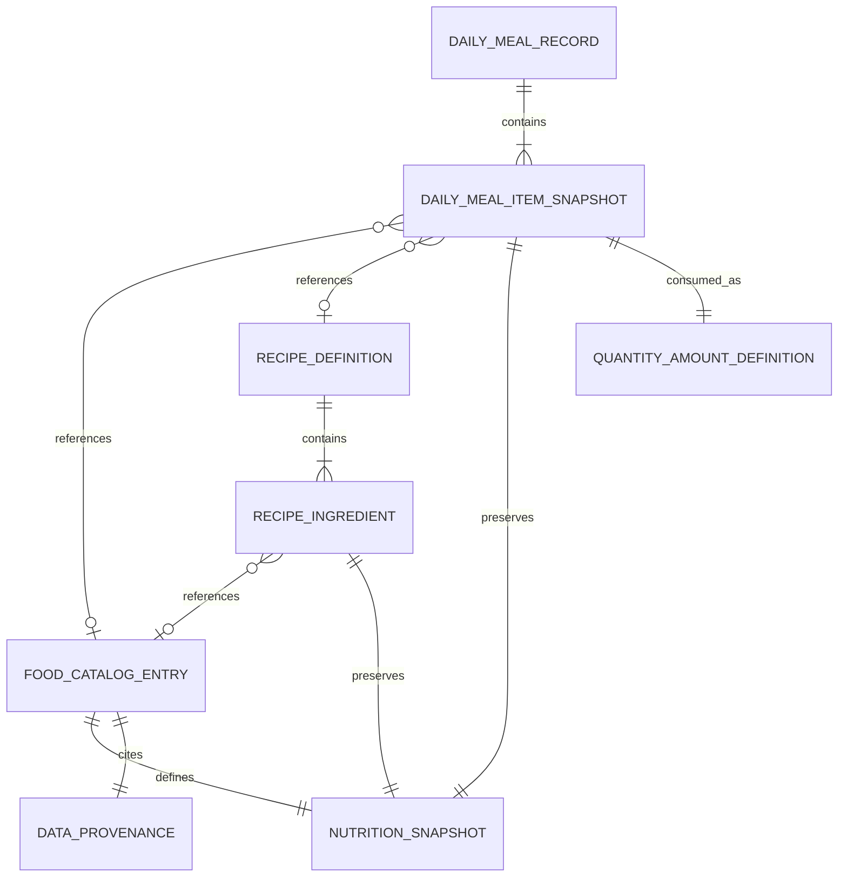

# FOOD Data Architecture

Status: design proposal only

Scope: TASK-057E

Baseline: `master` at `942583d56facc53124ef15add491fd3814bf117a`

## 1. Purpose

This document defines the target data architecture for FOOD before implementing FOOD SYNC. It separates reusable food knowledge from recipes and historical daily meal records, while preserving existing records, Operation Date behavior, finalized Daily Log snapshots, and Backup compatibility.

This document is not an implementation approval. It does not add Models, Repositories, Stores, migrations, routes, UI, or Sync adapters.

## 2. Current State Audit

### 2.1 Domain and UI

The current daily FOOD domain is `MealData` with an ID, date, meal type, memo, a list of `core/models/FoodItem`, and optional `waterMl`. A water entry is represented as a `MealData` record with `waterMl`; daily nutrition excludes those records and hydration sums them separately.

The daily `FoodItem` stores a name, per-base calories/P/F/C, legacy `quantity`, and optional measured-amount fields. It is already a value snapshot: the daily record does not resolve nutrition from a live catalog when read.

The manual entry UI creates these snapshots directly. New FOOD saves use the resolved Operation Date. Editing preserves the record's historical date. Finalized dates are protected by `DailyLogMutationGuard`.

Separately, `features/food/models` contains `FoodItem`, `FoodNutrition`, `Recipe`, and `RecipeIngredient`. These power beta meal templates, but they are not a formal persisted catalog or recipe repository. They have no dedicated IndexedDB Store, Backup section, or ORLO Sync adapter. Their presence must not be mistaken for an established persistence contract.

### 2.2 Persistence

`PersistedFoodRecord` is the current envelope:

- envelope `recordVersion`: `1`
- ID: `food:<mealId>`
- `localDate`: derived from `MealData.date`
- `createdAt` and `updatedAt`
- optional migration lineage
- `data`: current `MealData`

The `food_records` Store has a non-unique `by_local_date` index. Save and update use one read-write transaction on that Store. Reads reject unsupported record versions and report invalid records as partial corruption. Normal writes do not currently perform an explicit read-back verification.

IndexedDB is Version 5. No catalog or recipe Store exists.

### 2.3 Existing migration

The existing migration ID is `shared_preferences_food_v1_to_indexeddb_v3`. It is non-destructive to the SharedPreferences source, uses a five-minute lease, metadata, quarantine, transactional writes, and post-commit verification. Its output is the existing FOOD record envelope and daily snapshot shape. This migration must not be repurposed for the proposed architecture.

### 2.4 Backup Schema 3

Backup Schema 3 has seven formal sections: status, activity, food, training, daily-log confirmations, custom training exercises, and operation state. FOOD currently means the `food_records` Store only. Schema 2 compatibility remains supported with six sections and without operation state.

Catalog and recipe data are therefore not backed up today. Adding persistent catalog or recipe data later requires an explicit Backup schema decision; silently omitting them is not acceptable.

### 2.5 ORLO Sync Core

ORLO Sync currently recognizes `training`, `food`, and `dailyLog` type definitions at Schema 1.0. Only TRAINING has a production adapter. FOOD and DAILY LOG remain unavailable. The core provides parsing, validation, preview, conflict/block handling, explicit import, and adapter dispatch without external communication.

FOOD Sync must be built on this core after the FOOD persistence contract is approved. It must not derive its architecture from the current meal input form.

## 3. Problems

1. Reusable food identity and daily consumption are conflated in the current manual snapshot.
2. Brand, category, barcode, nutrition confidence, and provenance have no formal daily or reusable contract.
3. Recipes exist only as template-oriented in-memory definitions and depend on live item maps for calculation.
4. Current nutrition fields cannot distinguish an explicit zero from unknown because all four values are required and default workflows are numeric.
5. Current `quantity`, `amount`, `baseAmount`, and `amountMode` support legacy compatibility but are easy to misinterpret.
6. Daily items have no stable item ID or formal optional reference to a catalog entry or recipe.
7. Catalog edits or deletion cannot be represented independently from historical meals.
8. FOOD Sync cannot safely decide whether a payload is reusable catalog data, a recipe, or an immutable daily snapshot.
9. Persisting new entity types without extending Backup would create data loss during REPLACE ALL.

## 4. Design Principles

- Separate reusable definitions from historical events.
- The saved Daily Meal Item Snapshot is authoritative for historical display and totals.
- References improve traceability and future entry UX; they never replace the historical snapshot.
- Unknown is not zero. Nullable nutrient values and an explicit nutrition status preserve that distinction.
- Stable IDs and serialized enum values are language-neutral; Japanese labels belong to Presentation.
- Never infer brand, barcode, provenance, recipe membership, or catalog identity from a name.
- Never convert units without an explicit conversion contract.
- Never recalculate a finalized Daily Log from a live catalog or recipe.
- New migrations are non-destructive, deterministic, auditable, idempotent, and independently versioned.
- Sync import is preview-first, atomic, idempotent, and read-back verified.

## 5. Entity Responsibility

### 5.1 Food Catalog Entry

A reusable definition of one ingredient, packaged product, or prepared food. It owns stable identity, naming, optional commercial metadata, a base quantity, base nutrition, confidence/status, provenance, lifecycle state, and timestamps. It does not own consumption date, meal type, or consumed amount.

### 5.2 Recipe Definition

A reusable named composition with an ordered ingredient list and a declared yield. It owns recipe identity and definition history. It does not own a daily consumption event.

### 5.3 Recipe Ingredient

An ordered component of a recipe. It carries a reference when available and a creation-time food snapshot sufficient to preserve the recipe definition after catalog changes or deletion. It owns the ingredient amount used in the recipe.

### 5.4 Daily Meal Record

A historical event for one Operation Date and meal type. It owns the meal ID, local date, ordered item snapshots, memo, and timestamps. Existing water entries remain compatible, but separating hydration from FOOD is a later decision outside this design.

### 5.5 Daily Meal Item Snapshot

An immutable-at-save representation of what was consumed. It owns the displayed name, optional source reference, quantity/amount, nutrition snapshot, status/provenance snapshot, and ordering. Subsequent catalog or recipe edits do not alter it.

### 5.6 Nutrition Snapshot

Calories and P/F/C values for a declared base or consumed amount, plus calculation metadata where applicable. Each value is nullable so unknown and explicit zero remain distinct.

### 5.7 Quantity/Amount Definition

A value object defining magnitude, unit, basis, and calculation mode. It prevents ambiguous multiplication and makes current legacy behavior explicit.

### 5.8 Data Provenance

Structured evidence describing where nutritional information came from and when it was captured. It does not store raw prompts, raw imported files, or unrelated personal information.

## 6. Entity Relationship



Reference rules:

- A daily item may reference one catalog entry, one recipe, or neither.
- A daily item must not reference both a catalog entry and a recipe.
- A missing/deleted reference does not invalidate a valid historical snapshot.
- A new recipe ingredient should reference a catalog entry when selected from catalog; snapshot-only ingredients may be supported only after an explicit product decision.

## 7. Field Definitions

### 7.1 Food Catalog Entry

| Field | Type | Required | Rule |
|---|---|---:|---|
| `id` | String | yes | Stable UUID; never derived from name/barcode |
| `recordVersion` | int | yes | Initial value `1` |
| `name` | String | yes | Trimmed, non-empty; display spelling preserved |
| `brand` | String? | no | Manufacturer/brand display value |
| `category` | enum | yes | Stable ID such as `ingredient`, `preparedFood`, `packagedFood`, `beverage` |
| `barcode` | String? | no | Normalized digits/string; uniqueness policy remains open |
| `baseQuantity` | Quantity/Amount | yes | Positive, finite, unit-compatible |
| `nutrition` | Nutrition Snapshot | yes | Nullable nutrient values permitted |
| `nutritionStatus` | enum | yes | `verified`, `declared`, `calculated`, `estimated`, `unknown` |
| `provenance` | Data Provenance | yes | `unknown` source is valid |
| `memo` | String? | no | User note, not calculation evidence |
| `isArchived` | bool | yes | Prefer archive over destructive delete when referenced |
| `createdAt` | UTC DateTime | yes | Immutable |
| `updatedAt` | UTC DateTime | yes | Updated on definition change |

### 7.2 Recipe Definition

| Field | Type | Required | Rule |
|---|---|---:|---|
| `id` | String | yes | Stable UUID |
| `recordVersion` | int | yes | Initial value `1` |
| `name` | String | yes | Trimmed, non-empty |
| `ingredients` | ordered list | yes | At least one valid ingredient |
| `yieldQuantity` | Quantity/Amount | yes | Positive recipe output |
| `servingCount` | double? | no | Positive if supplied; does not replace yield |
| `nutrition` | Nutrition Snapshot | yes | Calculated snapshot at recipe save |
| `nutritionStatus` | enum | yes | Normally `calculated`; degrades with unknown inputs |
| `provenance` | Data Provenance | yes | Usually `recipeCalculation` |
| `memo` | String? | no | User note |
| `isArchived` | bool | yes | Keeps historical references resolvable when possible |
| `createdAt` / `updatedAt` | UTC DateTime | yes | Standard envelope timestamps |

### 7.3 Recipe Ingredient

| Field | Type | Required | Rule |
|---|---|---:|---|
| `id` | String | yes | Stable within recipe; UUID recommended |
| `foodReferenceId` | String? | conditional | Catalog reference when selected from catalog |
| `nameSnapshot` | String | yes | Preserves definition after reference changes |
| `quantity` | Quantity/Amount | yes | Amount included in recipe |
| `nutritionSnapshot` | Nutrition Snapshot | yes | Nutrition used for recipe calculation |
| `nutritionStatus` | enum | yes | Snapshot of ingredient confidence |
| `provenance` | Data Provenance | yes | Snapshot of source |
| `sortOrder` | int | yes | Non-negative and unique within recipe |

### 7.4 Daily Meal Record

| Field | Type | Required | Rule |
|---|---|---:|---|
| `id` | String | yes | Stable meal UUID; envelope prefix remains implementation-specific |
| `recordVersion` | int | yes | Proposed new domain/envelope version described below |
| `localDate` | `YYYY-MM-DD` | yes | Resolved Operation Date for new records; preserved on edit |
| `mealType` | stable enum | yes | Serialized stable ID, localized in UI |
| `items` | ordered list | yes | Non-water meal requires at least one item |
| `memo` | String? | no | Empty normalized consistently |
| `waterMl` | double? | legacy | Maintained for compatibility; finite and positive when present |
| `createdAt` / `updatedAt` | UTC DateTime | yes | Preserve creation time during edits |
| `lineage` | object? | migration only | Never fabricated for normal records |

### 7.5 Daily Meal Item Snapshot

| Field | Type | Required | Rule |
|---|---|---:|---|
| `id` | String | yes | Stable item UUID; deterministic for migration |
| `foodReferenceId` | String? | no | Catalog ID at save time |
| `recipeReferenceId` | String? | no | Recipe ID at save time |
| `name` | String | yes | Historical display name |
| `brand` | String? | no | Historical brand snapshot |
| `category` | enum? | no | Historical category snapshot |
| `quantity` | Quantity/Amount | yes | Exact consumed amount contract |
| `nutritionPerBase` | Nutrition Snapshot | yes | Values and base used at save time |
| `nutritionConsumed` | Nutrition Snapshot | yes | Calculated consumed values; consistency verified |
| `nutritionStatus` | enum | yes | Historical status |
| `provenance` | Data Provenance | yes | Historical source evidence |
| `sortOrder` | int | yes | Stable display order |

### 7.6 Nutrition Snapshot

| Field | Type | Required | Rule |
|---|---|---:|---|
| `caloriesKcal` | double? | no | Finite and non-negative; `null` means unknown |
| `proteinG` | double? | no | Finite and non-negative |
| `fatG` | double? | no | Finite and non-negative |
| `carbohydrateG` | double? | no | Finite and non-negative |
| `basisQuantity` | Quantity/Amount | yes | Basis for the values |
| `calculationMethod` | String? | conditional | Required for calculated values |
| `calculationVersion` | int? | conditional | Required with method |

No intermediate rounding is stored. Presentation may round. A stored consumed snapshot must match the per-base snapshot and quantity within an explicitly defined tolerance.

## 8. Nutrition Status

| Status | Meaning | Valid example |
|---|---|---|
| `verified` | Evidence was checked under an app-defined verification procedure | A label transcription reviewed against retained source metadata |
| `declared` | Directly transcribed from a declarative source, not independently verified | Manufacturer label or official product page |
| `calculated` | Deterministically calculated from identified inputs | Recipe total from ingredient snapshots |
| `estimated` | Approximate or heuristic value | ChatGPT-assisted estimate accepted by user |
| `unknown` | Value or its reliability cannot be established | Migrated legacy record without reliable provenance |

Status applies to the nutrition set, not the food's existence. `unknown` must not cause null nutrients to become zero. If individual-field confidence is later needed, it requires a separate versioned design rather than overloading this enum.

## 9. Data Provenance

Proposed stable source types:

- `manufacturerLabel`
- `manufacturerWebsite`
- `publicDatabase`
- `recipeCalculation`
- `userInput`
- `chatGptEstimate`
- `migration`
- `unknown`

Proposed fields:

| Field | Required | Rule |
|---|---:|---|
| `sourceType` | yes | Stable enum above |
| `sourceName` | no | Human-readable label, e.g. database/manufacturer name |
| `sourceReference` | no | URL, barcode reference, or public dataset key; length-limited |
| `capturedAt` | yes | UTC timestamp when values entered/imported |
| `sourceUpdatedAt` | no | Source-declared update time if known |
| `notes` | no | Short evidence note; not a raw prompt or document dump |

Manufacturer label and website must remain distinct. ChatGPT output is `estimated` unless backed by separately captured declarative evidence. Sync transport is not itself nutrition provenance: a synced manufacturer value remains `manufacturerLabel`, while import audit metadata separately records the Sync package.

## 10. Quantity/Amount Contract

### 10.1 Current contract

- With no measured fields, `quantity` is a legacy count and the nutrition multiplier is `quantity`.
- Measured values require `amount`, `baseAmount`, and `baseUnit` together.
- `physicalAmount`: multiplier = `amount / baseAmount`; physical amount = `amount`.
- `baseMultiplier`: multiplier = `amount`; physical amount = `baseAmount * amount`.
- Current daily records support only `g` and `mL`.
- When measured fields exist, `quantity` does not additionally multiply nutrition.

Examples:

- 200 g consumed from nutrition per 100 g: physical amount 200 g, multiplier 2.
- 1.5 base portions where one base is 80 g: physical amount 120 g, multiplier 1.5.
- Legacy quantity 3 with no measured amount: multiplier 3.

### 10.2 Target contract

Use a single explicit object:

```text
QuantityAmountDefinition
  value: positive finite decimal
  unit: stable unit ID
  basisValue: positive finite decimal
  basisUnit: same unit or approved conversion
  mode: physicalAmount | baseMultiplier | legacyCount
```

Rules:

- New normal writes must not use `legacyCount`.
- `physicalAmount` stores a physical consumed/yield value.
- `baseMultiplier` stores a dimensionless multiplier and still retains the base quantity.
- Units `piece`, `pack`, `serving`, and recipe-specific units require an explicit base equivalence. They must not be silently converted to grams or milliliters.
- Density-based g/mL conversion is outside the initial contract.
- Zero consumption is not a valid meal item; absence should be represented by no item.

## 11. Identity Contract

- Catalog, recipe, meal, meal-item, and recipe-ingredient IDs occupy separate namespaces.
- Normal IDs are UUIDs generated locally or supplied by an approved Sync payload.
- IDs are immutable. Name, brand, barcode, and normalized text are not IDs.
- Duplicate detection may use barcode or canonical digest as advisory evidence, but must not silently merge distinct IDs.
- Sync idempotency uses the payload entity ID plus canonical domain digest. Same ID/same digest is `NO CHANGES`; same ID/different digest is `CONFLICT` unless an explicit update protocol exists.
- Migrated child IDs are deterministic from migration ID, source record ID, and original index. Re-running migration yields identical IDs.
- References are type-safe: a catalog ID cannot resolve as a recipe ID.

## 12. Reference/Snapshot Contract

The snapshot is the historical source of truth. References are optional traceability.

1. Saving a daily item copies display, quantity, nutrients, status, and provenance into the item snapshot.
2. Editing a catalog entry or recipe affects only future selections. Existing meals and finalized details do not change.
3. Archiving or deleting a referenced catalog/recipe entity does not invalidate an existing meal snapshot.
4. Reopening a historical meal displays its snapshot. The UI may offer an explicit “refresh from current definition” action only in a future task and only before finalization.
5. Finalized Daily Log Detail remains snapshot-only and performs no live catalog/recipe lookup.
6. Recipe ingredients also retain snapshots, so a recipe remains inspectable if its catalog reference is unavailable. Recalculation from newer catalog values must be explicit, never automatic.

## 13. Persistence Recommendation

### 13.1 Options

| Option | Advantages | Risks |
|---|---|---|
| A. Separate `food_catalog_records`, `food_recipe_records`, existing `food_records` | Clear lifecycle and validation; efficient type-specific reads; clean Backup sections; future SQLite tables map naturally | Requires IndexedDB version bump, new Repositories, Backup schema bump |
| B. One new definition Store for catalog and recipes with discriminator | Fewer Stores and one version bump | Mixed indexes/validation; recipe/catalog conflicts; harder atomic integrity and future SQL mapping |
| C. Put all entities in `food_records` | No new Store name | Breaks current envelope assumptions and date index semantics; high corruption and query risk |

### 13.2 Recommendation

Choose Option A. Keep daily records in `food_records`; add dedicated catalog and recipe Stores in a separately approved implementation. Suggested indexes:

- catalog: `by_normalized_name`, non-unique; optional `by_barcode` only after uniqueness policy is approved
- recipe: `by_normalized_name`, non-unique
- daily records: retain `by_local_date`

Do not add Stores during TASK-057E. The implementation task must explicitly approve the IndexedDB version bump, Store registry, Repository container wiring, migration behavior, and Backup upgrade together.

For future SQLite, use separate `food_catalog`, `food_recipes`, `recipe_ingredients`, `daily_meals`, and `daily_meal_items` tables. Store immutable nutrition/provenance snapshots as versioned columns or child rows; do not rely on live joins for historical nutrition.

## 14. Record Version

Proposed initial versions:

- Food Catalog Record: `1`
- Recipe Record: `1`
- Daily Meal Record v2: `2`
- Daily Meal Item Snapshot: `1`
- Nutrition Snapshot: `1`
- Data Provenance: `1`

The existing `PersistedFoodRecord.recordVersion == 1` and embedded `MealData.toRecordJson()` string version `2.0` are different layers and must not be conflated. A future implementation must name and validate each layer explicitly.

Mixed v1/v2 reads are required before switching normal writes. Unknown record or snapshot versions are isolated as read issues; they are never coerced.

## 15. Migration Strategy

1. Add v2 domain/read projection tests without changing writes.
2. Add dedicated Stores and Repositories for catalog/recipe under an approved IndexedDB version bump.
3. Add mixed v1/v2 FOOD reads and preserve partial-corruption reporting.
4. Introduce a new migration ID; never reuse `shared_preferences_food_v1_to_indexeddb_v3`.
5. Convert existing v1 meals to v2 only with deterministic child IDs and lineage.
6. Map only provable values: name, saved nutrition, amount fields, meal date/type, memo, and ordering.
7. Set absent references to null and provenance/status to `migration`/`unknown`; do not infer catalog identity, recipe identity, barcode, brand, or authoritative source.
8. Preserve original v1 records non-destructively. If shadow v2 records are created, define preferred-read rules to prevent double counting and retain audit reads.
9. Use lease, attempt state, metadata, quarantine, atomic transaction, initial read-back verification, and source-invariance verification consistent with existing migration standards.
10. Switch normal writes to v2 only after mixed-read and Backup support are deployed.

Whether to use shadow records or a lazy read-only v1 projection is an open implementation decision. In-place destructive rewriting is not recommended.

## 16. Backup/Restore Impact

- Schema 3.0 remains unchanged for current data.
- Once catalog/recipe persistence exists, a new Backup schema version is required. The recommended shape adds separate `foodCatalog` and `foodRecipes` sections while preserving `food` for daily records.
- The future export includes all three FOOD responsibilities. Omitting definitions would make recipe/catalog restore incomplete.
- Older Schema 2/3 imports remain supported. Their FOOD records become legacy daily records; they do not fabricate catalog or recipe entities.
- MERGE uses stable ID plus canonical record equality. Same ID/different content is a blocking conflict unless an explicit update policy is approved.
- REPLACE ALL writes all formal Stores, including catalog and recipe, in one transaction and performs read-back/digest verification.
- Reference validation is performed against the package plus retained records according to import mode. A valid historical snapshot with a missing optional reference is not corrupt.
- Finalized Daily Log snapshots remain independently authoritative and are not regenerated after restore.

## 17. Sync Impact

Retain top-level ORLO `dataType: food` and add a required payload discriminator:

- `entityType: catalogEntry`
- `entityType: recipeDefinition`
- `entityType: dailyMeal`

Use separate versioned validators/mappers behind one FOOD adapter dispatcher. One Sync envelope imports one entity type; mixed heterogeneous payloads are rejected. This preserves the existing ORLO type registry while keeping domain contracts isolated.

Minimum rollout order:

1. Catalog Entry Sync after catalog persistence exists.
2. Daily Meal Sync after v2 daily writes and snapshots exist.
3. Recipe Sync after catalog references, recipe snapshots, and transactional integrity are implemented.

All variants require strict schema validation, canonical digest, ID-based idempotency, preview, explicit confirmation, atomic create/update policy, and read-back verification. Daily Meal Sync must use its payload `localDate`; it must not replace it with current Operation Date. Imports into a finalized date are blocked by the existing mutation/finalization contract.

Food Catalog and Recipe updates need a separately approved revision/conflict protocol. Initial Sync should be CREATE-only if safe update semantics are not yet defined. ChatGPT estimates must carry `chatGptEstimate` provenance and `estimated` status. No ChatGPT API or other external communication is introduced.

## 18. UI Responsibility

- Catalog UI: create/edit/archive reusable definitions, show base quantity, nutrition status, and provenance.
- Recipe UI: choose ingredient definitions, capture ingredient snapshots, declare yield, calculate recipe nutrition, and explicitly refresh inputs.
- Meal Entry UI: choose catalog/recipe/manual source, enter consumed quantity, preview the exact snapshot, and save to the resolved Operation Date.
- Meal Edit UI: load historical snapshots; preserve local date and immutable IDs; never silently refresh definitions.
- History/Detail: display stored meal snapshots and clearly label unknown/estimated values.
- Daily Review/Finalized Detail: consume the saved daily/confirmation snapshot only. No catalog or recipe lookup.
- Sync UI: select FOOD entity subtype, show provenance/status and conflicts, and require confirmation before import.

Presentation localizes category/status/unit labels. Serialized stable values remain unchanged. Unknown nutrition displays as unavailable/unknown, not `0 kcal`.

## 19. Field Decision Table

| Field/decision | Required? | Nullable? | Stored where | Source of truth | Snapshot behavior | Validation summary |
|---|---:|---:|---|---|---|---|
| Catalog ID | yes | no | catalog | catalog record | referenced only | Stable UUID, immutable |
| Name | yes | no | all entities | owning entity/snapshot | copied into recipe/meal | Trimmed, non-empty |
| Brand | no | yes | catalog, meal snapshot | catalog at selection | copied | No inferred brand |
| Category | yes for catalog | meal optional | catalog, meal snapshot | catalog | copied | Stable enum |
| Barcode | no | yes | catalog | catalog | not required in meal | Normalization/uniqueness TBD |
| Base quantity | yes | no | catalog/recipe/nutrition | definition | copied | Positive finite |
| Consumed quantity | yes | no | meal item | meal snapshot | immutable at save | Positive finite, compatible unit |
| Calories/P/F/C | structurally yes | values nullable | nutrition snapshot | stored snapshot | immutable at save | Null unknown; numeric finite/non-negative |
| Nutrition status | yes | no | definitions/snapshots | captured record | copied | Stable enum |
| Provenance | yes | no | definitions/snapshots | captured record | copied | Stable source type; bounded metadata |
| Food reference | no | yes | recipe ingredient/meal item | referenced catalog | reference plus snapshot | Type-safe; missing reference tolerated historically |
| Recipe reference | no | yes | meal item | referenced recipe | reference plus snapshot | Mutually exclusive with food reference |
| Meal local date | yes | no | daily meal | record | preserved | Canonical local date; new UI uses Operation Date |
| Meal type | yes | no | daily meal | record | preserved | Stable enum, no silent fallback |
| Sort order | yes | no | child items | parent aggregate | preserved | Unique non-negative within parent |
| Memo | no | yes | owning entity | owning entity | copied only when specified | Length limit TBD |
| Archive state | yes | no | catalog/recipe | definition | not copied | Referenced definitions favor archive |
| Created/updated timestamps | yes | no | envelopes | record | creation preserved | UTC, updated >= created |
| Migration lineage | migration only | yes | migrated record | migration | immutable | Deterministic and auditable |

## 20. Implementation Sequence

Each phase requires its own reviewed task and explicit editable scope.

1. **Domain contract**: versioned Catalog, Recipe, Quantity, Nutrition, Provenance, and Daily Meal v2 models with pure validation/serialization tests.
2. **Persistence foundation**: approved IndexedDB version bump, separate Stores, indexes, Repositories, container wiring, transaction/read-back tests.
3. **Backup upgrade**: new schema sections, Schema 2/3 compatibility, MERGE/REPLACE ALL, digest and reference-integrity tests.
4. **Mixed daily read model**: v1/v2 reads, unknown-version isolation, summary compatibility, no double counting.
5. **Migration**: new non-destructive deterministic migration or approved lazy projection, lineage/preferred-read/quarantine tests.
6. **Catalog UI**: reusable entry management and provenance/status display.
7. **Recipe UI**: ingredient snapshots, yield, deterministic calculation, explicit refresh.
8. **Meal Entry/Edit integration**: snapshot creation, Operation Date, finalize lock, legacy editing compatibility.
9. **FOOD Sync Catalog**: CREATE-only first, canonical digest and read-back verification.
10. **FOOD Sync Daily Meal and Recipe**: subtype-specific validation and reference handling after their persistence/UI contracts stabilize.
11. **Acceptance and cleanup**: Backup round-trip, migration recovery, responsive UI, finalized snapshot-only verification; no legacy removal until separately approved.

## 21. Open Questions

1. Is barcode unique globally, unique only among active catalog entries, or advisory only?
2. Which unit set is approved initially: only g/mL, or also piece/pack/serving with explicit equivalence?
3. Are snapshot-only recipe ingredients allowed at recipe creation, or must every ingredient reference catalog?
4. Should catalog/recipe deletion be prohibited when referenced, or implemented as archive-only?
5. Is recipe nutrition stored as a definition snapshot, recalculated only on explicit save/refresh, or revisioned?
6. Should legacy v1 meals use lazy projection or non-destructive v2 shadow records?
7. What are the exact preferred-read and lineage rules if shadow records are chosen?
8. What Backup schema version will introduce the two new sections?
9. Does initial FOOD Sync permit updates, or CREATE-only until entity revision semantics exist?
10. Are Sync subtypes accepted under `dataType: food`, as recommended, or must the ORLO registry expose separate top-level types?
11. What source evidence is sufficient for `verified` rather than `declared`?
12. What retention and maximum-length policy applies to provenance URLs/notes?
13. Should hydration remain a legacy `MealData` variant or move to an independent record in a later architecture task?
14. Should P/F/C permit partial knowledge per field, or require all four nutrient values together when status is not unknown?

## 22. STOP Conditions for Implementation

Stop before implementation and request approval if any of the following occurs:

- The entity/reference/snapshot responsibilities above are not approved.
- A Store, Index, IndexedDB version, Repository API, or container change is required without explicit scope.
- Backup cannot include every newly persisted formal entity in the same release.
- Schema 2/3 import compatibility or finalized snapshot-only behavior cannot be maintained.
- Migration would overwrite/delete v1 records or infer unprovable identity/provenance.
- Mixed v1/v2 reads would double-count meals or change existing summaries.
- Catalog or recipe edits would mutate historical or finalized snapshots.
- Unknown nutrition would be coerced to zero.
- Unit conversion would require unapproved density/equivalence assumptions.
- Sync requires an update/conflict rule, reference policy, or subtype decision not yet approved.
- FOOD Sync would bypass Operation Date, finalization locks, preview/confirmation, atomicity, idempotency, or read-back verification.
- The implementation requires changes to Operation State, Finalize/Recovery, Training, Activity, or external API communication.
