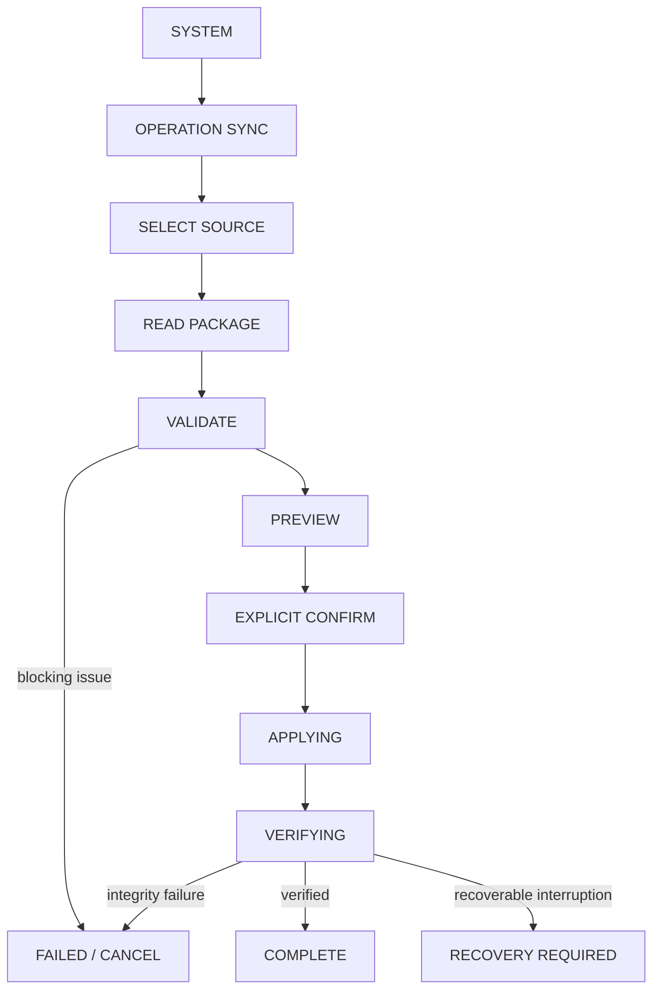

# Operation Sync Architecture

Version: 1.0

Status: Proposed for formal adoption

Last updated: 2026-08-02

This document is the design authority for future Operation Sync work. It
supersedes the draft assumptions in
[`architecture/OPERATION_SYNC.md`](architecture/OPERATION_SYNC.md) where the
two documents differ. It does not change the current application.

Normative terms such as **must**, **must not**, **may**, and **initial release**
describe implementation contracts. Items explicitly listed under Open
Questions are not approved implementation requirements.

## 1. Purpose

Operation Sync is the controlled data-transfer boundary for:

- moving a complete OR-APP data set to another device;
- converting identified legacy application data into current records;
- importing a future long-term archive;
- detecting conflicts with records already present on the target;
- recovering safely after an interrupted transfer; and
- retaining an auditable result without retaining the raw package.

Data preservation, explicit user confirmation, deterministic validation, and
read-back verification take priority over convenience. The initial release is
deliberately narrower than the complete long-term mission.

Operation Sync is not cloud synchronization and does not run automatically.

## 2. Current State Audit

### 2.1 Runtime and UI

- IndexedDB database: `operation_reboot_db`.
- IndexedDB version: `6`.
- The existing SYSTEM page owns the OPERATION SYNC route.
- The existing Operation Sync page is presentation-only. It shows STATUS,
  ACTIVITY, TRAINING, FOOD, and ARCHIVE cards plus `COMING LATER`.
- No Operation Sync parser, package, repository, coordinator, apply flow,
  recovery state, or audit history currently exists.
- Existing UI and `COMING LATER` remain unchanged by this design task.

### 2.2 IndexedDB stores

The runtime schema contains 14 stores.

| Store | Current responsibility | Operation Sync disposition |
| --- | --- | --- |
| `morning_facts` | IndexedDB v1 compatibility source | Never copied directly; identified legacy adapter only |
| `trainings` | IndexedDB v1 compatibility source | Never copied directly; identified legacy adapter only |
| `status_records` | STATUS v1 canonical and legacy revisions | Initial transfer target |
| `food_records` | FOOD v1 and Daily Meal v2 | Initial transfer target |
| `food_catalog_records` | Food Catalog record v1 | Initial transfer target and FOOD dependency |
| `food_recipe_records` | Recipe record v1 | Initial transfer target and FOOD dependency |
| `training_records` | TRAINING record v1/v2 | Initial transfer target |
| `activity_records` | ACTIVITY v1 canonical and legacy revisions | Initial transfer target |
| `activity_drafts` | Recoverable, non-formal draft | Import prohibited |
| `daily_log_confirmations` | Record v1 / snapshot v1 finalized truth | Initial transfer target under sealed-date rules |
| `migration_metadata` | Migration lease, state, counts, IDs, digests | Not transferred |
| `migration_quarantine` | Migration-specific failures | Not transferred as user data |
| `custom_training_exercises` | Custom exercise record v1 | Initial transfer target and TRAINING dependency |
| `operation_state` | Singleton `current`, record v1 | Not copied as a raw record |

The initial transfer therefore targets nine existing formal stores: the nine
sections currently represented by Backup Schema 4.0. It does not make Backup
Schema 4.0 the Operation Sync package format.

### 2.3 Backup contracts

- Backup Schema 2.0 has six sections.
- Backup Schema 3.0 adds the required `operationState` section.
- Backup Schema 4.0 adds `foodCatalogRecords` and `foodRecipeRecords`, for nine
  sections total.
- Backup Schema 4.0 performs one transaction across included stores for
  REPLACE ALL and MERGE, then performs read-back and startup-equivalent
  validation.
- Schema 3/4 validate the relationship between Operation State and Daily Log
  Confirmations.
- Schema 3/4 MERGE requires incoming Operation State to match current state and
  blocks a processing state.
- `activity_drafts`, migration metadata, migration quarantine, and legacy
  stores are excluded from Backup.
- Backup canonical digests currently use an internal 32-bit FNV-1a digest.
  That remains unchanged for Backup; it is not sufficient as the normative
  tamper-detection algorithm for a new transfer format.

### 2.4 Operation State, finalize, and recovery

- `operation_state/current` is the only valid Operation State record.
- Operation State record version is 1.
- Phases are `open`, `finalizing`, `finalizedPendingBackup`, and `advancing`.
- Any non-open phase requires a matching `activeAttempt` and therefore requires
  recovery.
- Finalize atomically writes the confirmation and moves Operation State to
  `finalizedPendingBackup` in a two-store transaction.
- Backup verification and Operation Date advancement are subsequent,
  idempotent recovery phases.
- Startup runs migrations, verifies repositories, bootstraps Operation State,
  and resumes finalize when recovery is required.
- If Operation State does not exist, bootstrap derives the next Operation Date
  from the newest confirmation; otherwise it uses the device date only for a
  genuinely new database.
- Confirmed dates are mutation-guarded, and finalized detail is snapshot-only.

Operation Sync must not impersonate finalize recovery, silently open a
processing state, discard an active attempt, or derive a transferred Operation
Date from the target device date.

### 2.5 Migration and quarantine

Existing migrations establish these reusable principles:

- fixed migration IDs and deterministic target IDs;
- strict source validation before mapping;
- five-minute leases and attempt counts;
- explicit writing, verifying, completed, and failed states;
- atomic target/metadata/quarantine writes where required;
- source, target, ID-set, count, and digest checks;
- initial read-back verification;
- non-destructive legacy sources;
- deterministic quarantine identities; and
- completed metadata structure verification without perpetual comparison of
  mutable target stores.

The current quarantine model is migration-specific and can retain a
`rawPayload`. Operation Sync must not place an entire transfer package or
clipboard input in that field.

### 2.6 Mixed-read and lineage contracts

- TRAINING reads v1 and v2 from `training_records`.
- Known shadow lineage prevents duplicate preferred display while preserving
  audit access to source and shadow records.
- Migration-derived TRAINING records remain read-only.
- FOOD mixed read keeps v1 and v2 as independent identities
  (`recordKind + recordId`) and does not infer references, provenance, or v2
  quantity from v1 data.
- Same names and dates do not imply record identity.

Operation Sync must import persisted identities and lineage, not read-model
projections. Preferred and mixed reads remain derived behavior.

### 2.7 REPORT SYNC

ORLO Sync currently provides a strict Envelope Version 1 parser, validator,
preview model, adapter registry, explicit apply call, and canonical JSON
utility. TRAINING REPORT SYNC is the only available adapter. It imports one
TRAINING v2 record using a fixed record ID and a single-store transaction with
read-back verification.

FOOD and DAILY LOG REPORT SYNC remain unavailable. REPORT SYNC is not a bulk
device-transfer protocol.

### 2.8 Archive capability

The current Dart runtime has no DNS, Execution Report, Training Archive,
week/month/year report, or SQLite archive model/repository. Existing references
to those concepts are roadmap or draft architecture statements. Their schemas
cannot be inferred from current code and are not initial import targets.

## 3. Responsibility Boundaries

| Capability | Owner | Purpose | Explicitly not its purpose |
| --- | --- | --- | --- |
| REPORT SYNC | Each module | Small, structured day-to-day record import, including TRAINING and future FOOD reports | Device transfer, multi-module archive, backup restore |
| BACKUP & RESTORE | DATA CENTER | Exact preservation and restore of current formal data using a supported Backup Schema | Legacy mapping, cross-schema migration planning, archive ingestion |
| OPERATION SYNC | SYSTEM | Identified cross-environment transfer, legacy conversion, bulk migration, conflict planning, recovery, audit | Normal input, normal Backup, ChatGPT API, cloud or real-time sync |

Operation Sync owns source identification, strict parsing, validation,
migration planning, conflict detection, preview, explicit confirmation,
atomic apply, read-back verification, recovery, and audit result creation.

It does not own module calculations, preferred-read rules, finalize logic,
daily entry, external communication, or background scheduling.

## 4. Supported Use Cases

### 4.1 Transfer modes

| Mode | Meaning | Initial release | Reason |
| --- | --- | --- | --- |
| `fullTransfer` | All supported formal modules from one current app snapshot | Yes | Safest complete device migration and easiest integrity boundary |
| `moduleTransfer` | One or more selected modules | Later | Cross-module references and finalized dates require dependency planning |
| `dateRangeTransfer` | Records within an inclusive Local Date range | Later | Confirmations and reference definitions cannot be selected by date alone |
| `archiveImport` | Append an approved long-term archive schema | Later | No runtime archive schema exists |

The initial release supports only `currentAppTransfer + fullTransfer`.
`legacyApp` adapters are the next supported source after their exact version
matrix and mappings are approved. `structuredManualImport` and `archive` remain
blocked until dedicated schemas exist.

### 4.2 Apply modes

The initial apply mode is `mergeCreateOnly`:

- existing records are never updated or deleted;
- exact same-ID records are no-op only when domain and timestamp checks both
  match;
- new IDs may be created only when all module, reference, date, and state
  constraints pass;
- any conflicting record blocks the complete package; and
- the user cannot waive a blocking issue.

`REPLACE ALL`, `MODULE REPLACE`, and `DATE RANGE REPLACE` are not initial
Operation Sync modes. Backup Restore terminology and semantics must not be
reused for them without a separate design approval.

### 4.3 Target profiles

Two target profiles are valid for initial planning:

1. **Pristine target**: all nine formal data sections are empty and the only
   Operation State is open, revision 0, has no last finalized date, and has no
   active attempt. A full transfer may create the complete dataset and
   reconstruct target Operation State from a verified source checkpoint.
2. **Existing target**: target Operation State must be open. It is preserved.
   Incoming records may only be exact no-ops or safe creates for its current
   open Operation Date. Any other date/state interaction blocks the package.

This distinction prevents a device migration from silently behaving as a
database replacement.

## 5. Source Package

### 5.1 Decision

Use a dedicated Operation Transfer Envelope. Do not use a Backup Package or an
ORLO Sync Envelope verbatim.

Reasons:

- Backup means exact same-schema restore and includes raw Operation State.
- ORLO Sync is a small, single-data-type REPORT SYNC envelope.
- Operation Sync needs multi-module manifests, migration identity, conflict
  planning, target-state preconditions, resumable verification, and a stronger
  integrity digest.

Canonical JSON ordering and parser techniques may be implemented as shared
low-level utilities, but protocol types and gateways remain separate.

### 5.2 Envelope Version 1

Recommended top-level shape:

```json
{
  "format": "operation-reboot-transfer",
  "envelopeVersion": 1,
  "schemaVersion": "1.0",
  "packageId": "uuid",
  "createdAt": "UTC timestamp",
  "sourceApplication": "operation-reboot",
  "sourceApplicationVersion": "version",
  "sourceDevice": {
    "platform": "web",
    "label": null
  },
  "sourceType": "currentAppTransfer",
  "transferMode": "fullTransfer",
  "modules": ["status", "activity", "training", "food", "dailyLog"],
  "records": {
    "status": [],
    "activity": [],
    "training": [],
    "food": [],
    "dailyLog": []
  },
  "manifest": {
    "recordCounts": {},
    "sectionDigests": {},
    "operationCheckpoint": {},
    "digestAlgorithm": "sha256"
  },
  "digest": "lowercase SHA-256 hex"
}
```

Each record entry must include `recordType`, `recordVersion`, `recordId`,
`idempotencyKey`, `canonicalDigest`, and `payload`. Dependencies such as custom
exercises, catalogs, and recipes are separate record types inside their owning
module, not hidden transport fields.

The package digest is SHA-256 over canonical UTF-8 JSON with the top-level
`digest` field omitted. Section digests use the same algorithm. The exact
canonical number/string rules must be frozen by test vectors before Stage 2.

The current FNV-1a Backup/ORLO helpers may inform canonicalization but must not
be presented as cryptographic tamper detection.

### 5.3 Source device privacy

`sourceDevice.platform` is allowed. `sourceDevice.label` is optional,
user-visible, and must default to null. Hardware serials, advertising IDs,
account identifiers, browser fingerprints, IP addresses, and unrestricted
device metadata are prohibited.

### 5.4 Source types

| Stable ID | Meaning | Initial handling |
| --- | --- | --- |
| `currentAppTransfer` | Export created from a verified compatible OR-APP database | Supported |
| `legacyApp` | Package created by an approved adapter for a named legacy app/schema | Blocked until adapter/version approved |
| `archive` | Package conforming to an approved immutable archive schema | Blocked until archive schema exists |
| `structuredManualImport` | Explicitly constructed package with a separately approved schema | Blocked; not treated as REPORT SYNC |
| `unknown` | Source cannot be identified and versioned | Always blocked from formal persistence |

Source type, source application, application version, and schema version are
all required inputs to adapter selection. Display labels do not select an
adapter.

### 5.5 Limits

The parser must enforce configured byte, record-count, nesting-depth, and
per-record limits before creating a plan. Exact numeric limits require browser
profiling and are an Open Question. Exceeding a limit is a blocking validation
result, never an invitation to truncate.

## 6. Module Scope

| Module / record type | Classification | Contract |
| --- | --- | --- |
| STATUS v1 canonical/revision | Initial | Preserve record ID, kind, Local Date, version, migration source, timestamps, and data |
| ACTIVITY v1 canonical/revision | Initial | Preserve Digestive Event and Carry Over as part of the record |
| ACTIVITY draft | Import prohibited | Draft is not a formal record or Backup section |
| TRAINING v1 | Initial | Preserve exact record; do not infer v2 |
| TRAINING v2 normal | Initial | Preserve ID and exact domain payload |
| TRAINING v2 shadow/migration | Initial | Preserve validated lineage and deterministic identity |
| Custom Training Exercise v1 | Initial dependency | Validate before TRAINING references; preserve normalized identity |
| Preferred TRAINING projection | Derived, not imported | Recomputed by existing repository/read model |
| FOOD v1 | Initial | Preserve exact v1; do not infer v2 references or provenance |
| Daily Meal v2 | Initial | Preserve references plus snapshots, Local Date, stable meal type, and null/zero distinctions |
| Food Catalog v1 | Initial dependency | Validate before Daily Meal references |
| Recipe v1 | Initial dependency | Validate ingredients/snapshots before Daily Meal references |
| FOOD mixed-read projection | Derived, not imported | Recomputed; identity remains record kind plus record ID |
| Daily Log Confirmation record/snapshot v1 | Initial, sealed-date rules | Preserve exact snapshot; never regenerate during transfer |
| Operation State | Reconstructed control state | Raw record import prohibited |
| Migration metadata/quarantine | Import prohibited | Local execution metadata, not user facts |
| Legacy `morning_facts` / `trainings` stores | Direct import prohibited | Read only through an approved legacy adapter |
| DNS / Execution Report / Training Archive | Design unconfirmed | No current runtime model/repository |
| Week/Month/Year Report | Import prohibited initially | Derived/future; no current formal archive contract |
| SQLite archive | Design unconfirmed | Future storage is not a current format |

`dailyLog` is a system dependency even though the current UI does not show it
as a top-level card. The UI must not advertise a module as selectable until its
adapter and dependency rules exist.

## 7. Identity and Idempotency

### 7.1 Identity layers

- **Package ID**: UUID generated once for one immutable package. It is not
  sufficient to establish record equality.
- **Record ID**: persisted module ID, including its namespace and version
  constraints.
- **Idempotency key**: stable transfer key composed from source identity,
  module, record type, and source record identity.
- **Canonical digest**: SHA-256 of the approved domain projection.
- **Source identity**: source application/type/schema plus immutable source key;
  never name/date-only.
- **Migration identity**: fixed adapter migration ID plus source identity and,
  where existing contracts require it, duplicate ordinal.

### 7.2 Canonical projection

The canonical record projection includes record ID, record version, Local Date,
record kind, formal domain fields, reference IDs, snapshots, stable IDs, list
order, lineage/migration source, null, and explicit zero.

It excludes transport fields, display-only labels, runtime hashes, package ID,
and temporary UI state. `createdAt` and `updatedAt` are excluded from the domain
digest but are preserved and validated independently. Read-back requires both:

1. domain digest equality; and
2. exact timestamp equality plus `updatedAt >= createdAt`.

Module-specific canonical services already used by FOOD v2 and TRAINING v2 may
be reused only when their projection matches this contract. Other record types
need explicit canonical projections and test vectors.

### 7.3 Idempotency outcomes

| Incoming vs target | Initial outcome |
| --- | --- |
| Same package replay after completed audit | Rebuild preview; all records must resolve to no-op |
| Same ID, same domain digest, same timestamps | `duplicateNoChange`, information, automatic no-op |
| Same ID, same domain, different timestamps | `canonicalConflict`, blocking |
| Same ID, different domain | `recordIdConflict`, blocking |
| Different ID, same content, unrelated source identity | Create; legitimate repeated facts are distinct |
| Different ID, same content, same source identity/lineage | No-op if mapping proves equivalence; otherwise blocking conflict |
| Corrected content | Unsupported initially; requires an approved Correction Package contract |
| Already migrated source | Deterministic target/migration identity must yield no-op or conflict, never a second record |

Names, dates, exercise labels, food names, and content similarity alone are not
identity.

## 8. Conflict Model

| Stable code | Meaning | Severity | Automatic resolution | User override initially |
| --- | --- | --- | --- | --- |
| `duplicateNoChange` | Exact identity/content/timestamp already exists | Information | No-op | Not needed |
| `recordIdConflict` | Same persisted ID, different content | Blocking | Forbidden | No |
| `canonicalConflict` | Domain/source equivalence disagrees with envelope metadata or target identity | Blocking | Forbidden | No |
| `referenceConflict` | Missing, incompatible, or conflicting referenced definition/lineage | Blocking | Forbidden | No |
| `versionUnsupported` | Envelope, schema, record, or snapshot version unsupported | Blocking | Forbidden | No |
| `migrationUnavailable` | Required source-to-target adapter is absent | Blocking | Forbidden | No |
| `historicalFinalizedConflict` | Incoming change would alter a finalized date | Blocking | Exact no-op only | No |
| `operationStateConflict` | Source checkpoint and target state cannot safely coexist | Blocking | Forbidden | No |
| `processingStateConflict` | Source or target is in a processing/recovery phase | Blocking | Forbidden | No |
| `integrityFailure` | Digest, count, ID set, read-back, or cross-record invariant fails | Blocking | Forbidden | No |

Warnings are reserved for information that does not alter persisted meaning,
such as optional source labels being omitted. Initial apply is blocked by any
blocking issue and does not offer per-record selection.

## 9. Historical Finalized Data

Finalized history is sealed by its Daily Log Confirmation snapshot.

Initial policy:

- A non-pristine target accepts no new or changed record for a Local Date that
  already has a confirmation.
- Exact records and the exact confirmation may resolve to no-op.
- A record may not be inserted beneath an existing snapshot, even if the
  snapshot summary appears unchanged.
- Confirmation/snapshot regeneration is prohibited.
- A Correction Package is not implemented in the initial release.
- A pristine full transfer may atomically create historical records and their
  original confirmations after package-wide integrity validation.
- A missing, mismatched, unsupported, or orphan confirmation blocks the full
  transfer.

This preserves snapshot-only detail, confirmation digest, finalize
idempotency, Operation Date progress, and auditability.

## 10. Operation State

### 10.1 Source

A current-app exporter must require source Operation State to be `open`.
Packages are not created while finalize recovery is required.

The raw `operation_state/current` record is not placed in `records`. The
manifest contains a validated `operationCheckpoint` with only:

- `operationDate`;
- `lastFinalizedDate`;
- source revision for audit;
- phase, which must be `open`; and
- the confirmation ID/digest needed to prove `lastFinalizedDate` when present.

No `activeAttempt` is transferable.

### 10.2 Target

- Target phase must be `open`; otherwise `processingStateConflict` blocks even
  preview-to-apply transition.
- For a pristine target, Operation State is reconstructed from the verified
  checkpoint in the same apply transaction. The target record keeps its local
  canonical ID and creation identity, increments revision, sets phase `open`,
  clears active attempt, and adopts the verified operation/last-finalized
  dates.
- For an existing target, Operation State is never overwritten. Source and
  target Operation Dates must agree for any create; otherwise apply is blocked.
- Operation Date is never changed using the device date or timezone.
- A processing source/target is never changed to open automatically.
- Recovery Required is reported from Operation Sync's own state and does not
  masquerade as Daily Finalize recovery.

## 11. Atomicity and Recovery

### 11.1 Initial transaction boundary

The initial current-app full transfer has a strict package size limit and uses
one IndexedDB read-write transaction across:

- every target formal store present in the plan;
- `operation_state` when a pristine state reconstruction is approved; and
- the future `operation_sync_state` store.

Within the transaction it must re-check the approved plan, target Operation
State revision, target identities, unique indexes, reference dependencies, and
expected package digest before writing. It writes dependency definitions before
dependent records, then reads back IDs and canonical digests. Any exception
aborts the transaction.

The transaction commits `operation_sync_state` as `verifying`. Verification
then re-reads every expected record outside the transaction. Completion is
recorded only after counts, ID sets, domain digests, timestamps, references,
confirmations, and Operation State all match.

### 11.2 Recovery states

Recommended phases are:

`reading -> validating -> planned -> awaitingConfirmation -> applying -> verifying -> completed | failed | recoveryRequired`

The persistent state stores no raw package. It stores package/section digests,
expected IDs/digests, approved target revision, counts, phase, attempt, and
failure code. If the package must be parsed again, the user reselects it and
its digest must match.

Recovery rules:

- interrupted before commit: no target writes; resume from a matching package;
- interrupted after commit: startup performs read-back verification from the
  stored manifest;
- successful verification: append audit history, then clear active sync state;
- verification mismatch: mark `recoveryRequired`, disable new Operation Sync
  apply, and do not claim partial success;
- automatic deletion or overwrite as rollback is prohibited initially.

If profiling shows the all-store transaction is unsafe at the approved limits,
implementation must STOP. Chunk/checkpoint import requires a separate design
with staging or before-images; it must not silently replace this atomicity
contract.

## 12. Migration

Migration adapters are selected by exact source application, source type,
source schema, module, and version. Their pipeline is:

`parse -> legacy validation -> mapping -> canonical conversion -> target validation -> plan -> atomic save -> read-back -> metadata/audit`

Mapping is pure and separately testable. The coordinator owns orchestration,
not module mapping rules.

### 12.1 Non-inference policy

| Module | Unrecoverable source value policy |
| --- | --- |
| STATUS | Reject when a required formal field cannot be reconstructed |
| ACTIVITY | Reject required data; preserve Digestive Event and Carry Over exactly; never promote a draft |
| TRAINING | Preserve v1 when valid; use existing deterministic v2 lineage only for an approved adapter; `legacyUnknown` only where the existing migration contract explicitly permits it |
| FOOD | Preserve valid v1 as v1; do not infer v2 reference, provenance, or quantity; use null/unknown only where the target domain explicitly permits it |
| Daily Log Confirmation | Require an exact supported snapshot; never synthesize one from incomplete facts |
| Catalog/Recipe | Require strict record validation; do not invent references or nutrition |
| Operation State | No record mapping; use the validated checkpoint policy |
| Archive | No mapping until a formal archive schema exists |

Allowed representations are therefore module-specific: valid null, stable
`unknown`, an explicitly modeled legacy snapshot, or rejection. An adapter must
never guess a formal value merely to make validation pass.

Migration IDs use
`operation_sync:<sourceApplication>:<sourceSchema>:<module>:<targetRecordVersion>:v<adapterVersion>`.
The ID is immutable after release. A changed mapping requires a new adapter
version.

## 13. Quarantine

Initial current-app full transfer is all-or-nothing. Invalid records block the
package and are not written to quarantine as a substitute for success.

For later legacy adapters, the existing `migration_quarantine` store may be
used only for record-level migration failures because its semantics and indexes
are migration-specific. Each entry must contain a deterministic quarantine ID,
migration ID, source system/key/section/index, failure code, detected time, and
optional conflict digests. `rawPayload` must be null or a minimal sanitized
record fragment; it must never contain the full package or clipboard text.

Package-level parse, digest, state, and integrity failures belong in Operation
Sync audit history as codes and digests, not in migration quarantine.

Reprocessing requires the same package digest and migration identity, creates
a new attempt, and cannot mutate a completed quarantine item into a formal
record without running the full current adapter and validation again.

## 14. Audit History

Operation Sync needs immutable, queryable execution summaries. Each history
record contains:

- operation ID and attempt;
- package ID and package digest;
- source type/application/schema (no raw source);
- started/completed UTC timestamps;
- selected modules and transfer/apply mode;
- create, update, no-op, conflict, and quarantine counts;
- result (`completed`, `failed`, or `recoveryRequired`);
- failure code; and
- final verification digest.

Initial `update` count is always zero because `mergeCreateOnly` cannot update.
History must not contain raw package text, record payloads, clipboard content,
or unnecessary device information.

History is local operational evidence and is excluded from Backup Schema 4.0
and transfer packages. A future diagnostics export may expose a redacted
summary after separate approval.

## 15. UI Flow



Stage displays:

| Stage | Required information |
| --- | --- |
| Select Source | Accepted source/type, local file privacy, no external upload |
| Read Package | Filename, size, read progress, cancel |
| Validate | Format/versions, package digest, source identity, modules, record counts |
| Preview | Target profile, creates/no-ops, blocking conflicts by module/date/code, Operation Date effect |
| Confirm | Immutable package digest, exact action, warning that app enters maintenance mode |
| Applying | Attempt, package digest suffix, progress phase; no misleading per-record success |
| Verifying | Counts, ID sets, references, snapshots, and state checks |
| Complete | Audit ID, verified counts, resulting Operation Date, startup validation result |
| Failed | Failure code, no-change/rollback status, safe next action |
| Recovery Required | Locked operation ID, expected package digest, reselect/resume guidance |

The existing module cards become status/coverage indicators for adapters. In
the initial release STATUS, ACTIVITY, TRAINING, FOOD, and the implicit DAILY
LOG dependency are included by Full Transfer. ARCHIVE remains `COMING LATER`.
Cards must not imply independent selection until `moduleTransfer` is approved.

## 16. Device Transfer Flow

### 16.1 Old device

1. Complete or recover any in-progress Daily Finalize.
2. Open Operation Sync export for `currentAppTransfer`.
3. Read all supported stores in one consistent read-only transaction.
4. Validate repositories, references, confirmations, and open Operation State.
5. Build and validate the Operation Transfer Package.
6. Save/share the file through an explicit user action.

### 16.2 New device

1. Install/open the same or a compatible OR-APP version and complete startup.
2. Open SYSTEM -> OPERATION SYNC.
3. Select the package file locally.
4. Validate, preview, and explicitly confirm.
5. Apply atomically and read back.
6. Run startup-equivalent repository and state validation.
7. Show the transferred Operation Date and verification audit ID.
8. Retain the original file until the user accepts the new device.

Use Backup Restore when restoring a supported OR-APP Backup Package with the
same Backup Schema semantics. Use Operation Sync for cross-environment
transfer, identified legacy conversion, or future archive adapters. A Backup
file must not be renamed and treated as an Operation Transfer Package.

## 17. Security and Privacy

- Parse locally; Operation Sync performs no external communication.
- Reject unknown fields and unsupported versions.
- Verify SHA-256 package and section digests before preview and immediately
  before apply.
- Bind confirmation to the immutable package digest and target-state revision.
- Enforce file size, record count, and structure-depth limits before mapping.
- Never persist raw package/clipboard text in logs, history, state, or
  quarantine.
- Clipboard import is not initial; file selection is the initial input path.
- Export requires an explicit destination action and a warning that the file
  contains private health/life data.
- Import requires a second explicit confirmation after preview.
- Device identifiers are minimized as described in Section 5.3.
- Errors shown or logged use stable codes and redacted record identities.

Encryption is strongly recommended for a later stage but is not part of this
task or the initial unencrypted-envelope contract. Until encryption exists,
the UI must state that the file is integrity-protected, not confidential.

## 18. Persistence Recommendation

### 18.1 Options

| Option | Recovery | Audit/query | Coupling | Store cost | Recommendation |
| --- | --- | --- | --- | --- | --- |
| A. Reuse migration metadata/quarantine | Weak for package/apply phases | Poor; migration fields do not model operations | High semantic coupling | None | Reject |
| B. Add `operation_sync_history` only | Cannot safely checkpoint applying/verifying | Good completed history | Recovery must live elsewhere/in memory | One | Reject |
| C. Separate `operation_sync_state` and `operation_sync_history` | Explicit active attempt/checkpoint | Immutable queryable summaries | Clear responsibility | Two | Adopt |

Option C is the formal recommendation.

- `operation_sync_state` contains at most one active operation/checkpoint and
  is not an extension of `operation_state/current`.
- `operation_sync_history` contains immutable redacted outcomes.
- Legacy record failures may use existing `migration_quarantine` under Section
  13; it does not replace either new store.

This separation supports recovery, future SQLite tables, retention policies,
and audit queries without expanding the already specialized migration model.
No store is added by this design task.

## 19. Backup Relationship

- Backup Schema 4.0 remains unchanged.
- Operation Sync history and active processing state are not included in
  Backup Schema 4.0.
- A processing Operation Sync prevents Backup Restore/Operation Sync apply
  from starting; persistence coordinators need one maintenance lock.
- Operation Transfer Packages are not Backup Packages.
- Backup canonical serializers and strict record validators may be reused as
  implementation components, but Backup schema/version semantics are not.
- Existing Schema 2/3/4 files remain importable only through Backup Restore.
- Operation Sync may read current formal records that overlap Backup sections,
  but it creates its own manifest, SHA-256 digests, and source checkpoint.
- A future Backup schema is required only if the product later decides to back
  up Operation Sync audit history. It is not required for Stage 1-3.

## 20. Report Sync Relationship

Reusable low-level concepts from ORLO Sync:

- strict JSON parsing patterns;
- unknown-field rejection;
- canonical JSON ordering (with a new SHA-256 digest contract);
- issue/severity presentation concepts; and
- preview-before-apply structure.

Components that must remain separate:

- Envelope and version registry;
- UI route and source input;
- adapter registry;
- idempotency/persistence history;
- multi-module dependency planner;
- transaction coordinator; and
- recovery state.

TRAINING REPORT SYNC continues to import one daily TRAINING record. Operation
Sync transfers persisted TRAINING v1/v2 records and lineage in bulk. Neither
entry point invokes the other. FOOD REPORT SYNC remains a future module feature
and is not implemented through Operation Sync.

## 21. Implementation Sequence

### Stage 1: Operation Sync Core and Persistence

**Purpose**

Freeze core models, issue codes, SHA-256 canonical test vectors, planning state,
maintenance lock, and the two recommended stores. Implement no module writes.

**Dependencies**

IndexedDB v6 transaction abstraction, startup initialization, Operation State
repository, and existing canonical validators.

**Change scope**

Core Operation Sync models/services/repositories, IndexedDB version/store
definitions, startup recovery gate, and focused tests. Backup Schema remains 4.

**User-visible changes**

Operation Sync can report idle/recovery status, but import remains unavailable.

**Acceptance**

Strict state transitions, single active operation, restart recovery state,
redacted immutable audit records, no raw payload persistence, and schema
migration/read-back tests.

**STOP conditions**

Cannot coordinate maintenance with Backup/finalize; two-store persistence
cannot represent crash recovery; SHA-256 canonical bytes cannot be made stable
across supported platforms.

### Stage 2: Transfer Package and Module Adapters

**Purpose**

Implement Envelope 1 export/import, `currentAppTransfer + fullTransfer`, module
validators, dependency/reference planning, conflict detection, and atomic
create-only apply.

**Dependencies**

Stage 1 persistence, all current persisted record parsers, Operation State and
confirmation integrity, and repository verification.

**Change scope**

Transfer parser/exporter, STATUS/ACTIVITY/TRAINING/FOOD/DAILY LOG adapters,
atomic coordinator, read-back verifier, file gateway, and contract tests.
Legacy/archive adapters remain unavailable.

**User-visible changes**

None beyond internal/test access until Stage 3.

**Acceptance**

Pristine full transfer, existing-target safe no-op/create plan, deterministic
replay, all defined conflicts, sealed-date protection, state reconstruction,
transaction rollback on injected failure, post-commit recovery verification,
and zero partial-success results.

**STOP conditions**

All-store transaction fails within approved limits; a current record lacks a
stable validator/canonical projection; confirmation/source checkpoint cannot be
proven; reference order cannot be made atomic.

### Stage 3: UI and Acceptance

**Purpose**

Connect SYSTEM -> OPERATION SYNC to file selection, validation, preview,
confirmation, apply, verification, recovery, and audit result.

**Dependencies**

Stages 1-2, local file gateway support, and startup-equivalent validation.

**Change scope**

Operation Sync page/widgets, route-integrated coordinator, responsive tests,
end-to-end acceptance fixtures, and user-facing privacy/error copy.

**User-visible changes**

Full current-app device transfer becomes available. ARCHIVE and unsupported
source types remain `COMING LATER`.

**Acceptance**

Complete old/new device flow, explicit confirmation bound to digest/revision,
responsive states, safe cancellation, failure/recovery instructions, verified
Operation Date, no external traffic, and unchanged REPORT SYNC/Backup entry
points.

**STOP conditions**

Browser file APIs cannot provide bounded local reads; UI cannot prevent apply
without the exact approved preview; startup cannot block safely on Operation
Sync recovery.

## 22. Field and Contract Decision Table

| Field / contract | Decision | Validation / notes |
| --- | --- | --- |
| `format` | `operation-reboot-transfer` | Exact stable string |
| `envelopeVersion` | integer `1` | Unknown rejected |
| `schemaVersion` | string `1.0` | Selected with source adapter |
| `packageId` | UUID | Immutable, non-empty, not sole idempotency key |
| `createdAt` | UTC timestamp | Required; no timezone/date rewriting |
| `sourceApplication` | stable application ID | Required |
| `sourceApplicationVersion` | exact source version | Required for adapter selection |
| `sourceDevice.platform` | minimal stable platform | Required |
| `sourceDevice.label` | nullable user label | Optional; no hardware/account IDs |
| `sourceType` | stable IDs in Section 5.4 | `unknown` always blocked |
| `transferMode` | initial `fullTransfer` | Others unsupported initially |
| `modules` | stable ordered set | Must match record sections and manifest |
| `records` | typed section arrays | Strict fields, stable list order |
| `manifest.recordCounts` | per record type/section | Must match parsed records |
| `manifest.sectionDigests` | SHA-256 | Must match canonical section bytes |
| `manifest.operationCheckpoint` | open state summary | Raw active attempt prohibited |
| `manifest.digestAlgorithm` | `sha256` | No silent algorithm fallback |
| `digest` | lowercase SHA-256 hex | Covers envelope excluding itself |
| record ID | persisted target ID | Module validator required |
| record idempotency key | source + module + type + source key | Stable across package replay |
| record canonical digest | SHA-256 domain projection | Excludes timestamps; preserves null/zero/order |
| timestamps | preserved separately | Exact read-back; updated >= created |
| initial apply mode | `mergeCreateOnly` | No update/delete/replace |
| confirmed-date handling | exact no-op or pristine atomic transfer | No snapshot regeneration |
| source Operation State | manifest checkpoint only | Source must be open |
| target Operation State | preserve or pristine reconstruction | Never device-date sync |
| active sync state | dedicated singleton store | Excluded from Backup/transfer |
| audit history | dedicated immutable store | Redacted; excluded from Backup 4 |
| legacy quarantine | existing migration quarantine | Minimal sanitized fragment only |
| raw package persistence | prohibited | Digest/manifest summaries only |
| external communication | prohibited | Local file flow only |
| encryption | not initial | Future design; integrity is not confidentiality |

## 23. Open Questions

These items require evidence or later product approval and are not silently
approved specifications:

1. Exact maximum package bytes, records, nesting depth, and all-store
   transaction thresholds after Chrome/iOS browser profiling.
2. Whether SHA-256 should use an approved Dart dependency or platform Web
   Crypto while producing identical canonical test vectors.
3. Exact supported `sourceApplicationVersion` compatibility window.
4. Legacy application/source version matrix and per-module mappings.
5. Formal DNS, Execution Report, Training Archive, week/month/year report, and
   SQLite archive schemas.
6. Correction Package identity, authorization, and finalized-date workflow.
7. Retention and deletion policy for local Operation Sync audit history.
8. Whether a future encrypted Envelope 2 is mandatory before archive import or
   optional for user-selected storage destinations.
9. Platform-specific file save/share and reselect behavior, including iOS PWA
   limitations.
10. Whether later module/date-range transfers require explicit dependency
    closure or a user-visible blocked-reference workflow.

None of these questions prevents the initial three-stage architecture from
being adopted. An implementation task touching one of them must resolve it
before changing source or schema.

## 24. Implementation STOP Conditions

Stop a future implementation and request approval when:

- the requested source/version has no approved adapter or canonical mapping;
- a formal field would need to be guessed;
- a reference/snapshot/lineage invariant cannot be preserved;
- source or target Operation State is processing;
- a non-pristine target would receive a historical/finalized mutation;
- the exact approved preview no longer matches target revision/content;
- atomic apply cannot be guaranteed within approved limits;
- recovery would require silently opening state, deleting facts, or treating a
  partial apply as success;
- a new replace, correction, archive, encryption, or cloud-sync contract is
  required;
- Backup Schema, REPORT SYNC semantics, finalize, preferred reads, or module
  domain contracts would need to change outside the approved task; or
- implementation requires files outside its explicit editable scope.

Do not stop merely because an optional source label is absent or an Open
Question unrelated to the active implementation remains unresolved.

## Audit References

This architecture was checked against the following current sources:

- `AGENTS.md` and `TASK_TEMPLATE.md`
- `lib/data/indexed_db/indexed_db_schema.dart`
- `lib/data/indexed_db/indexed_db_store_names.dart`
- `lib/data/indexed_db/indexed_db_migration_metadata.dart`
- `lib/data/indexed_db/indexed_db_quarantined_record.dart`
- `lib/features/import_export/models/backup_package.dart`
- `lib/features/import_export/services/backup_export_service.dart`
- `lib/features/import_export/services/backup_import_planner.dart`
- `lib/features/import_export/services/backup_import_service.dart`
- `lib/features/import_export/services/backup_operation_state_integrity.dart`
- `lib/features/import_export/services/backup_store_registry.dart`
- `lib/features/operation_date/models/operation_state.dart`
- `lib/features/operation_date/models/operation_active_attempt.dart`
- `lib/features/operation_date/services/operation_state_bootstrap_service.dart`
- `lib/features/operation_date/services/daily_finalize_coordinator.dart`
- `lib/features/operation_date/services/daily_finalize_transaction.dart`
- `lib/features/operation_date/services/daily_finalize_recovery_service.dart`
- `lib/core/services/startup_initialization_service.dart`
- current STATUS, ACTIVITY, TRAINING, FOOD, and confirmation persisted models
- current Activity/Food/Training migration services and Training lineage
- `lib/features/food/services/food_mixed_read_service.dart`
- `lib/features/sync/` ORLO Sync models/services
- `lib/features/training/sync/training_sync_adapter.dart`
- `lib/features/system/pages/system_page.dart`
- `lib/features/system/pages/operation_sync_page.dart`
- `docs/food_data_architecture.md`
- existing architecture/database/project/roadmap documents
